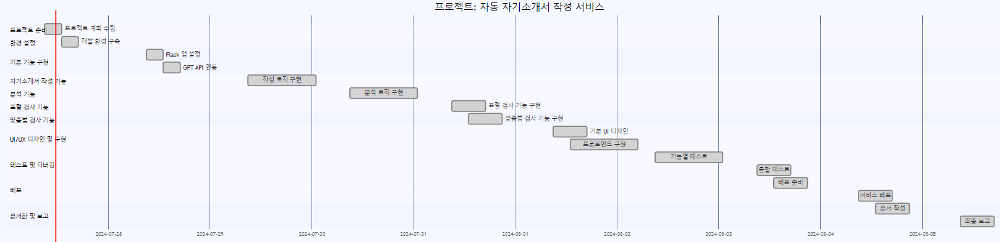

# Flask_GPTapi 토이 프로젝트

## 배포주소
http://43.203.240.66:5000/

## 시작하기

1. **의존성 설치**: 필요한 모든 의존성을 설치하세요.
   ```bash
   pip install -r requirements.txt

   ```
2. **실행하기**
   ```bash
   python app.py
   ```

## WBS


## 기술 스택
**Enviroment**  

  


**Development** 

 
 
 
 


## 프로젝트 소개
AI_자기소개서는 GPT_API 기술을 사용하여 자기소개서를 분석하고 개선하는 Flask 기반 애플리케이션입니다. 이 애플리케이션은 텍스트 분석을 위한 다양한 방법을 제공하여 자기소개서를 더 설득력 있고 일관되게 만들기 위한 인사이트와 개선점을 제공합니다. 기능은 다음과 같습니다.

- 자기소개서 작성
- 자기소개서 분석
- 카피킬러
- 맞춤법 검사기


 ## 화면 구성 📺

| 자기소개서 작성 | 자기소개서 분석  |
| --- | --- |
|  | 
 |

| 카피 킬러 | 맞춤법 검사 |
| --- | --- |
|  | 
 |


# 회고
## 코드 분석
```python
class SelfIntroductionWriter: # 자기소개서 작성

class SelfIntroductionAnalyzer: # 자기소개서 분석

class PlagiarismDetector: # AI카피킬러

class SpellChecker: # 맞춤법 검사

class PromptOptimizerApp # 위의 다양한 기능들을 작업 수행
```

- 각 기능의 클래스에 들어가는 프롬프트 최적화 기법
  - iterative_refinement: 여러 번의 반복을 통해 자기소개서를 점진적으로 개선합니다.
  - step_by_step: 자기소개서를 개별 단계로 나누어 상세히 분석합니다.
  - few_shot: 예제를 사용하여 분석을 안내하고 타겟 피드백을 제공합니다.
  - constraint_setting : 특정 제약 조건을 가지고 자기소개서를 분석하여 철저함을 보장합니다.


## 느낀점 및 개선해야할 점
- 이번 프로젝트는 기존에 해보지 못한 기능 및 프레임워크를 사용하는 것을 생각하며 프로젝트를 진행하게 되었습니다. 그래서 Flask라는 프레임워크를 웹개발 제작과 AWS EC2를 통한 배포까지 진행하게 되었습니다.</br>
처음부터 진행이 매끄럽진 않았지만 이 프로젝트를 진행하면서 다양한 경험을 하게 되면서 성장한다는 기분이 들었습니다

- app.py에서 class를 활용하며 코드의 가독성을 높이려했지만 아직 부족한 점이 있는 거 같다. 이후에는 상속기능을 사용하면 더욱 코드가 간결하고 깔끔해질 거라 생각이 듭니다
